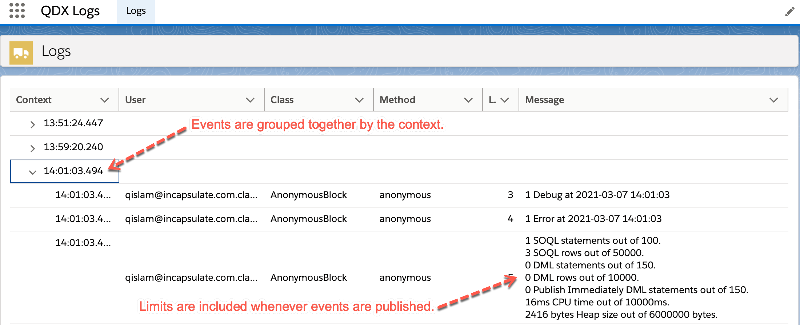
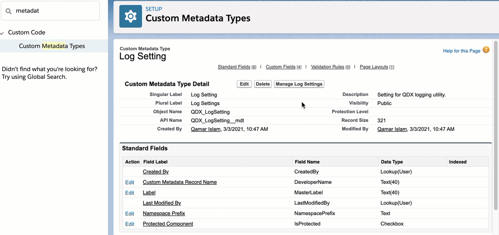
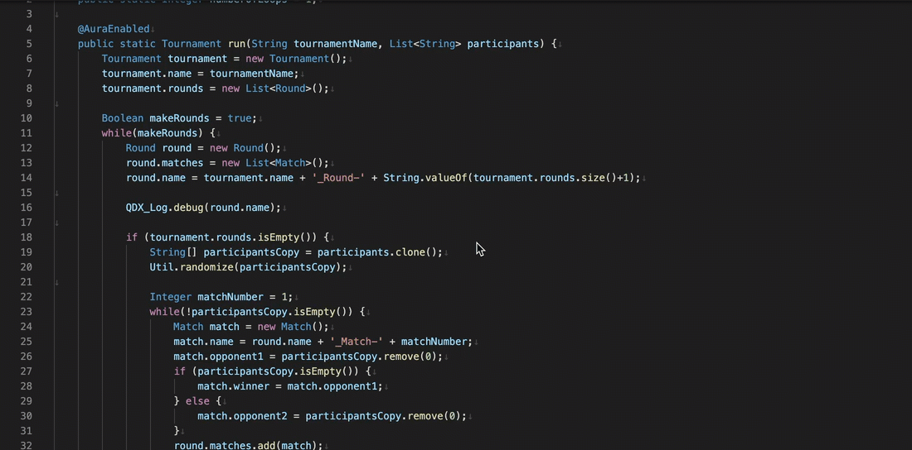

# Salesforce Logging Utility

This utility is based on salesforce platform events for providing an efficient alternative to traditional System.debug logging. You can configure this utility to get log events for a specific class and method. You can also filter the log results for a specific user as needed.

## How to Configure

Configuration is simple. Just add the __qdxLogMonitor__ lightning web component to any lightning app page where you would like to see the log events.

To get log events for a class, start by setting up "Log Setting" custom metadata type records. Set the MasterLabel of record  same as the class API name. This is case sensitive so make sure it matches exactly with the class API name. Set the aggregate checkbox to true if you want to control when the events are fired. If set to false, you will see events as the code is executed even if the transaction fails or rolls back.

Within your classes, you can replace any System.debug statements with QDX_Log.debug method. If you need to persist error in database, you can call the QDX_Log.error method. For this to work, you will also need to configure a metadata type record where QDX_ErrorClassName is set to the class API name where QDX_Log.IError interface is implemented.

Enjoy!
